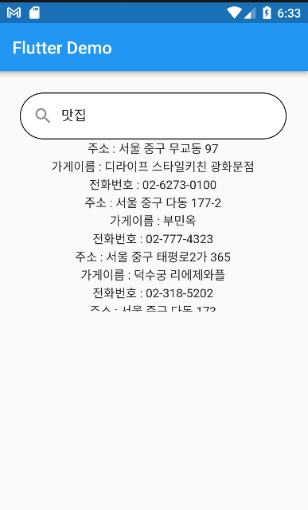

### reference
- 강의 - https://www.youtube.com/watch?v=UCmjtoqu5aw&list=PLnIaYcDMsScxP2Nl8pEbmI__wkF0YVu0a&index=3 
- API - https://docs.flutter.dev/cookbook/design/themes, https://docs.flutter.dev/get-started/install
- 라이프 사이클, 구조 등등 https://velog.io/@realryankim/Flutter-LifeCycle%EC%83%9D%EB%AA%85%EC%A3%BC%EA%B8%B0

### 2023-03-06
- 기본 셋팅중

### 2023-03-07
- https://docs.flutter.dev/development/ui/layout/tutorial

### 2023-03-08
- https://docs.flutter.dev/development/ui/layout/building-adaptive-apps
- MouseRegion Widget 사용했는데 앱에서는 작동X 웹에서만 작동
- 클릭시 bump되는 이미지로 바꾸려고 시도 -> 하긴했으나 썩 마음에 들진않음

### 2023-03-09
- https://pub.dev/packages/kakaomap_webview (kakaomap_webview 0.6.2 )
- https://developers.kakao.com/docs/latest/ko/local/dev-guide 로컬 API
- 
- 로컬 API에서 특정좌표 기준 키워드로 입력하면 검색결과를 받아 리스트로 뿌려주고 클릭시 지도로 넘어가는 식으로 구현 해보려함
- DTO클래스 만드는데 null safety? sdk 버전문제인지 자꾸 컴파일에러뜸

### 2023-03-10
- REST API로 가게이름 가져와서 뿌림 대충 만들어봤으나 잘만든진 모르겠음 타이핑마다 쿼리날려서 리스트가져옴
- 인스턴스 필드 가시성을 private 으로하면 생성자에서 언더바 안 된다고 뜸 (?)
- 리액트랑 좀 비슷한데 함수포인터 넘기면서 상태를 끌어올리고 내리고 그럼 Provider라고 상태관리 라이브러리가 있다고함
- 마지막으로 아이템 클릭이벤트시 위도경도 해당하는 웹뷰뿌리기하고 마칠예정